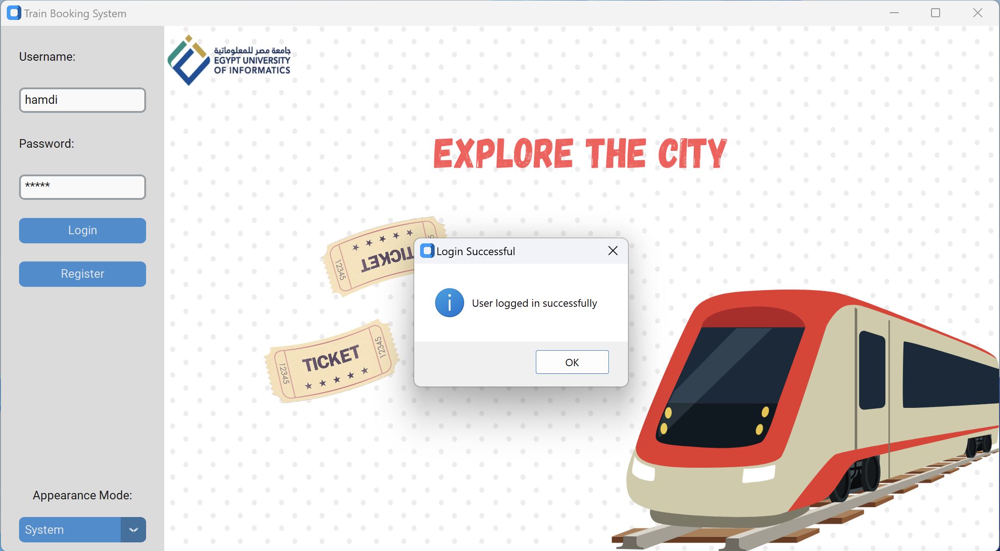

# 🚄 Railway Booking System  
*A Database-Driven GUI Ticket Reservation Platform with Dynamic Routing*  


---

## 📖 Table of Contents  
- [Project Overview](#-project-overview)  
- [Key Features](#-key-features)  
- [Core Business Rules](#-core-business-rules)  
- [Database Architecture](#-database-architecture)  
- [Setup Guide](#-setup-guide)  
- [Usage Demo](#-usage-demo)  
- [Algorithm Deep Dive](#-algorithm-deep-dive)  
- [Team Contributions](#-team-contributions)  

---

## 🚀 Project Overview  
This system manages railway operations for **7 predefined routes** with automated seat allocation, multi-route transit handling, and a 24-hour booking window. 

  

Built with:  
- **Backend**: Python + MySQL  
- **Frontend**: Custom Tkinter GUI  
- **Security**: SHA-256 + Salted Password Hashing  

---

## ✨ Key Features  
| Feature | Description |  
|---------|-------------|  
| **Auto-Seat Assignment** | Seats fill sequentially (Coach 1 → Coach 4) |  
| **Dynamic Station Routing** | DFS algorithm finds reachable stations within 24 hours |  
| **Transit Management** | Multi-route trips grouped under `Together_ID` (max 3 tickets) |  
| **Cost Calculation** | Fare = `((Travel Time + 5 mins) / 2) * 25` units |  
| **User Authentication** | Secure registration/login with password hashing |  

---

## 📜 Core Business Rules  
1. **Train Structure**  
   - 4 coaches/train × 25 seats/coach = 100 seats total.  
   - Trains operate on fixed routes (no route switching).  
2. **Route Design**  
   - 7 main routes: 5 × 12-hour routes (6 stations), 2 × 6-hour routes (3 stations).  
   - Adjacent stations are **2 hours apart**.  
3. **Timing**  
   - Trains on the same track run 6/12 hours apart.  
   - All trips fit within a 24-hour window.  

---

## 🗃️ Database Architecture  
### ER Diagram  
  

### Key Tables  
| Table | Description |  
|-------|-------------|  
| `Ticket` | Stores seat, route, and booking group (`Together_ID`) |  
| `Station` | Contains station names and cities |  
| `Track` | Edges between stations with departure times |  
| `Train` | Train IDs and metadata |  
| `Coach` | Tracks seat occupancy per train |  
| `User` | Stores user credentials securely |  

### Normalization  
All tables satisfy **3NF** (no transitive dependencies).  

---

## ⚙️ Setup Guide  
1. **Clone Repository**  
   ```bash
   git clone https://github.com/hamdiitarek/railway-booking-system.git
   cd railway-booking-system
   ```  
2. **Database Setup**  
   - Install **MySQL Community Server**.  
   - Configure MySQL credentials in `env.txt` using the following format:  

     ```
     localhost
     DB_Port
     Root_Username
     Database_Password
     Database_Name
     ```
   
3. **Install Dependencies**  
   ```bash
   pip install -r ./requirements.txt
   ```  
4. **Launch Application**  
   ```bash
   python main.py
   ```  

---

## 🖥️ Usage Demo  
### 1. Login/Register  
  
- New users are added to the `User` table with encrypted passwords.  

### 2. Book Tickets  
- **From Station**: Dynamic dropdown (all stations).  
- **To Station**: DFS-generated reachable stations.  
  

### 3. View Tickets  
- Tickets grouped by `Together_ID` for multi-route trips.  
- Displays seat, price, and transit details.  


---

## 🧠 Algorithm Deep Dive  
### 1. **DFS for Reachable Stations**  
```python
def dfs_find_reachable(fStation, dept_time, total_time, target):
    if total_time >= 24 or fStation in visited:
        return
    visited.add(fStation)
    for neighbor in get_neighbors(fStation):
        dfs_find_reachable(neighbor, ...)
```  
- **Purpose**: Ensure trips fit within 24-hour window.  
- **Edge Handling**: Skips backtracking to the origin station.  

### 2. **Seat Assignment Logic**  
```sql
UPDATE Coach 
SET Seats_taken = Seats_taken + 1 
WHERE Train_ID = ? AND Coach_number = ?;
```  
- Coaches fill sequentially; seat numbers auto-increment (1-25 per coach).  

---

## 👥 Contributing Team

<a href="https://github.com/hamdiitarek">
  
</a>
<a href="https://github.com/Doha04">
  
</a>
<a href="https://github.com/abdelrahman-safwat">
  
</a>
<a href="https://github.com/omarrwalid">
  
</a>
<a href="https://github.com/Lionixes">
  
</a>
